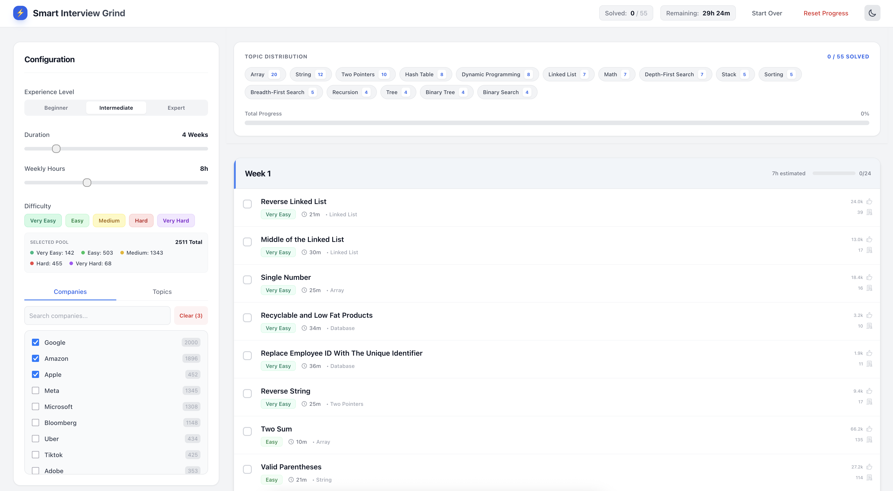

# ⚡ Smart Interview Grind

**Your Intelligent AI-Powered Prep Scheduler.**

Stop randomly solving problems. This tool generates a **tailored interview preparation schedule** based on your exact time constraints, target companies, and experience level.



## ✨ Features

*   **Smart Scheduling**: Distributes problems intelligently over weeks (e.g., "6 hours/week for 4 weeks").
*   **Company Targeting**: Focus on specific companies like Google, Meta, or Amazon.
*   **Dynamic Difficulty**: Adjusts problem mix based on your experience (Beginner vs. Expert).
*   **Progress Tracking**: Mark problems as "Done" and watch your completion percentage rise.
*   **Current Company Data**: Refreshes company-wise questions from the configured GitHub source.

## 🚀 How to Use

1.  **Launch**: Open the application in your browser.
2.  **Configure**:
    *   Select your experience level.
    *   Choose your target companies.
    *   Set your weekly time commitment.
3.  **Grind**: Follow the generated visual schedule.

---

## 👨‍💻 Local Development

If you are the developer maintaining this repo:

### 1. Setup

The easiest way to prepare the local data and open the development server is:

```bash
./run.sh
```

On the first run, the script installs dependencies and downloads the complete question catalog
from [`snehasishroy/leetcode-companywise-interview-questions`](https://github.com/snehasishroy/leetcode-companywise-interview-questions)
into the ignored `.cache/` directory, builds the app's question catalog, and
opens the app. Every later run checks GitHub for updates and regenerates the
catalog only when the source commit changes. If GitHub is temporarily
unavailable, an existing cached copy is used.

To run each step manually:

```bash
npm ci

# Clone or update the source repository
git clone --depth 1 \
  https://github.com/snehasishroy/leetcode-companywise-interview-questions.git \
  .cache/leetcode-companywise-interview-questions

# Build the app catalog from every company's all.csv
npm run sync-data

# Start Dev Server
npm run dev
```

### 2. Deployment
To deploy to GitHub Pages:
```bash
SETUP_ONLY=1 ./run.sh
npm run deploy
```

The question source repository does not declare a software/data license and
states that its CSV files were generated from LeetCode Premium. Its data is
downloaded only into your local ignored cache and is not redistributed here.

## Attribution

This project is maintained by [Rohan Dubey](https://github.com/rohankumardubey)
at [`rohankumardubey/leetcode-companywise-prep`](https://github.com/rohankumardubey/leetcode-companywise-prep).
See [`NOTICE`](./NOTICE) for upstream software and data-source attribution.

---
*Built with ❤️ by [@rohankumardubey](https://github.com/rohankumardubey)*
